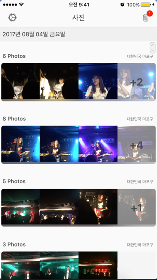
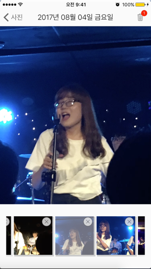
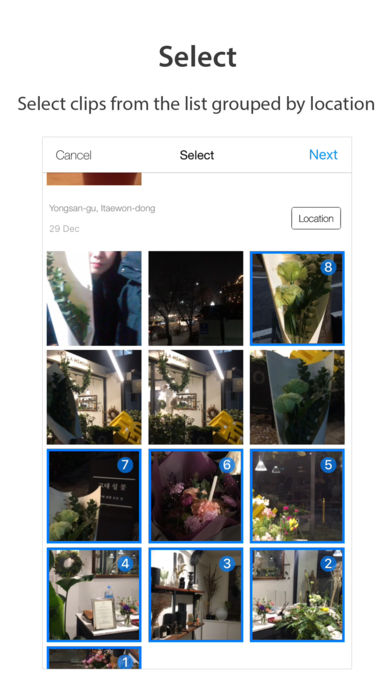
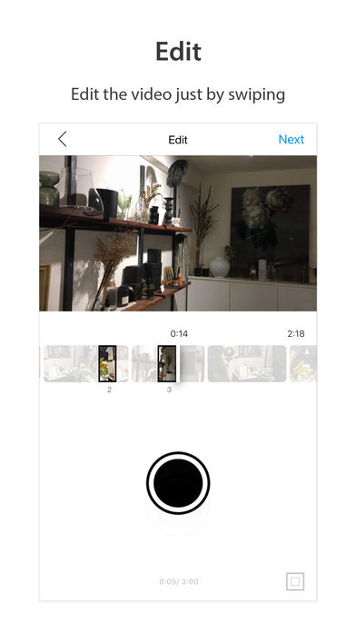
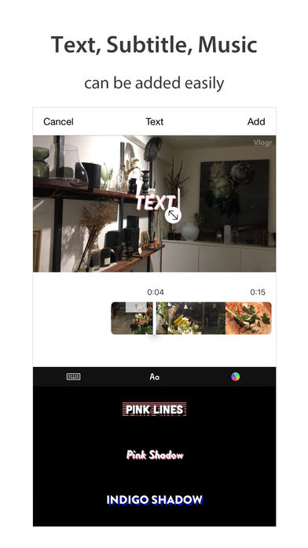
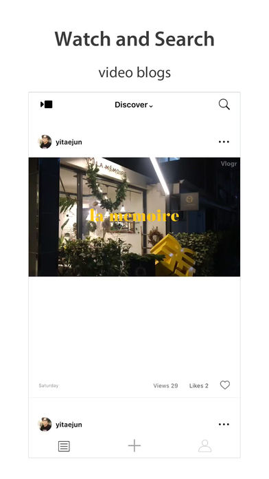

# 유준상

- **2019년 2월 졸업 예정**입니다.

### 개인정보
- [Github](https://github.com/wnstkdyu)
- [Blog](https://wnstkdyu.github.io)
- [wnstkdyu@gmail.com](mailto:wnstkdyu@gmail.com)

### 보유 기술
- 언어
  - **Swift**: 중고급
  - **Objective-C**: 초급
- 기타
  - **UI 구성 능력**: 중급
  - **Github**: 중급
  - **Realm**: 초급

### 학력

- 수원고등학교
- 고려대학교 경영학과 / 융합보안학과: 2012.03 ~ 2019.02(졸업예정)
- 기본적인 CS 과목을 이수: 자료구조, 알고리즘, 운영체제
  - 나머지 네트워크와 데이터베이스는 KOCW로 수강하였습니다.
  - [CS 공부 리포지터리](https://github.com/wnstkdyu/CSStudy)

### 교외 교육

#### 고려대 iOS 겨울방학 특강

- 교육 기관: 고려대학교 SW중심대학 + [CodersHigh](https://codershigh.github.io/WebSite/)
- 2016.12 ~ 2017.02
- 교육내용
  - iOS 기초
  - Swift 기초
  - Git 기초
  - 앱 개발 프로토타이핑
  - HIG
  - 팀 프로젝트(1월 1일 - 당신의 목표 달성을 위하여)

#### Boostcamp iOS 교육

- 교육기관: [네이버 커넥트재단](http://boostcamp.connect.or.kr/)
-  2017.07 ~ 2017.08
- 교육내용
  - iOS Programming Guide
  - The Swift Programming Guide
  - HIG
  - 아론 힐리가스의 iOS 프로그래밍
  - 모둠/개인 과제
  - 팀 프로젝트([Picka - 사진 관리 어플리케이션]((https://itunes.apple.com/kr/app/picka-%EC%82%AC%EC%A7%84-%EA%B4%80%EB%A6%AC/id1274880048?mt=8)))
- [Boostcamp 리포지터리](https://github.com/wnstkdyu/boostcamp_iOS_Alpaca)

___

### 주요 프로젝트

## [Picka - 사진 관리 어플리케이션](https://itunes.apple.com/kr/app/picka-%EC%82%AC%EC%A7%84-%EA%B4%80%EB%A6%AC/id1274880048?mt=8)

**사진을 모아주고 정리하는 것을 도와주는 어플리케이션**

[프로젝트 리포지터리](https://github.com/RodoPacaGiraffe/BoostCamp_iOS_Electo)

### 사용한 기술
- `Swift 3` `Xcode 8`
- `Photos` `Image Caching` `Animation` `Localization` `Delegate pattern` `Notification` `Observer`

### 수행 역할

- `Auto Layout`과 `Interface Builder`를 통한 UI 구현.
- `UITableView` 사진 이미지 비동기적으로 받아와 나타내기.
- `CLGeocoder`를 통한 사진의 위치 표시.

### Trouble Shooting
-  비동기적 요청으로 인한 재사용 이슈

    - 문제: 빠르게 스크롤하는 경우나 뷰 전환 시 메인 뷰의 사진 순서가 뒤바뀌는 경우가 발생
    - 연구: 셀이 재사용되는데 `cellForRowAt`에서 이미지를 `fetch`한 동작이 비동기적으로 동작하기 때문에 이전에 요청했던 사진이 표시되는 것. 팀원과 상의 후 명확한 해결책이 떠오르지 않아 튜터님께 질문.
    - 해결: 이미지 `fetch`시 request의 `identifier`를 cell에 보관 후 이전 request를 `cancel`시키는 방안을 적용.

- iCloud 사진 표시 이슈

  - 문제: iCloud 사진을 택하고 다른 사진을 선택했을 시 전에 요청된 사진이 잠깐 표시됨
  - 연구: iCloud 사진을 받아오는 데에 로컬 사진을 받아오는 데 걸리는 시간보다 더 많이 걸리기 때문에 생기는 문제라 판단
  - 해결: 이 문제 역시 request를 `cancel`시키는 방법을 떠올려 보았지만 **fullSize** fetch의 경우 일단 받아놓는 것이 좋다고 판단되어 요청할 때와 표시할 때의 `indexPath`를 비교해 같으면 이미지를 표시하는 방법을 선택.

- 메인 화면 이미지 표시

  - 문제: 메인 화면에서 테이블 뷰의 각 셀이 총 네 개의 이미지를 보여주기 때문에 이 이미지들을 각각 받아와 보여주는 경우 `cellForRowAt`에서 처리하기가 애매.
  - 연구: 팀원들과 상의 후 해결.
  - 해결: 그룹의 `PHAsset`의 배열에서 받아올 때 `UIImage`의 배열을 만들어 넣어준 뒤 `completion handler`를 통해 이미지들을 다 받아왔을 경우에 이미지를 표시.

- 콜렉션 뷰 인덱스 에러

  - 문제: 디테일 뷰에서 풀사이즈의 사진을 스와이프하면 다음 사진이나 이전 사진으로 전환되는데 하단의 콜렉션 뷰에서 끝까지 스와이프 하고 난 뒤 스와이프를 할 경우 크래시 발생.
  - 연구: 이미지를 스와이프했을 시 콜렉션 뷰의 `didSelect`를 호출해 풀사이즈의 이미지를 다시 불러오는 데 이 때 **화면에 보이지 않는** `cell`의 `indexPath`를 통해 부르기 때문
  - 해결: 처음 해결법은 먼저 `selectCell` 메서드를 통해 먼저 셀을 선택하고 `thread sleep`을 하여 셀이 다 구성된 뒤 이미지를 불러오게 하는 방법이었으나 이는 옳지 않은 방법이라 판단되어 `didSelect` 안에 `guard` 문을 통해 셀이 아직 구성되지 않았을 경우 다시 이미지를 불러오는 식으로 해결.

#### 스크린샷

  

## [Vlogr](https://itunes.apple.com/kr/app/vlogr/id1179975615?mt=8)

**일상을 전달하는 Vlog 소셜 네트워크**

### 사용한 기술
  - `Objective-C` `Swift` `Xcode 9`
  - `Parse` `CALayer` `CoreLocation` `Delegate Pattern` `Notification` `Observer` `Singleton Pattern`

### 수행 역할
- 재사용되는 코드를 묶어서 관리
  - 공통적으로 쓰이는 `UITableViewCell`들을 `nib`파일로 묶어 재사용성 증대.
  - `PushNotification`, `BlockUsers(불량 유저를 막는 기능)` 등 공통적으로 쓰이는 요소를 하나의 `Singleton Pattern`을 적용.
  - 여러 `UITableView`의 `dataSource`를 하나의 `ViewModel` 객체로 만들어 각각의 인스턴스로 관리.
- 동영상 전체화면으로 전환시 `UIModalPresentationStyle`의 `overFullScreen`을 적용해 아래의 뷰가 자연스럽게 흐려지도록 구현.
- 좋아요 갯수를 표시하는 화면에서 느리게 받아오는 문제를 `UITableViewDelegate` 메소드인 `willDisplay` 안에서 쿼리를 미리 날려 게시물 별 좋아요를 미리 받게끔 수정
- 온/오프라인, 로그인/둘러보기 관계없이 `BlockUsers` 싱글턴 객체로 `UserDefaults`를 이용해 로컬에 저장했다가 서버에 업로드 시 서버와 싱크를 맞춰줌.
- 둘러보기를 구현하여 로그인을 하지 않아도 편집을 할 수 있게끔 구현
- 로그인 화면 구성 시 `UIStackView`에 `View`를 넣었다 빼는 애니메이션 적용
- `AppAuth` 라이브러리를 사용해 구글로 `OAuth` 적용 후 YouTube 업로드 기능 추가
- 로컬라이징
- 전체적으로 `Auto Layout` 적용

#### 스크린샷

   
